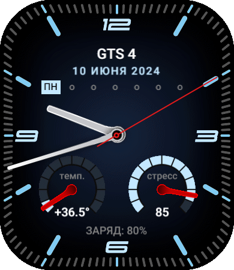
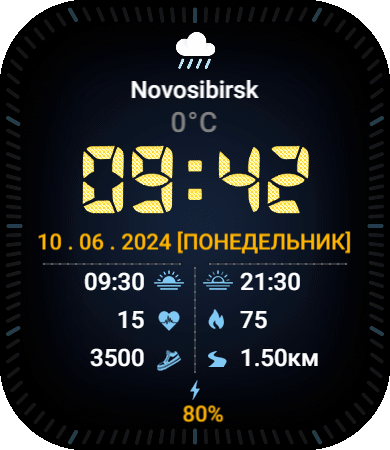
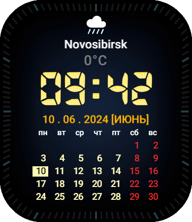
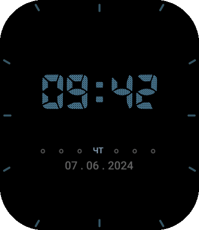

# AmazActive
Мой циферблат для часов Amazfit Active

!(pr1_time.png)

**Превью циферблата**

**Название:** ActiveMAX
**Версия часов:** Amazfit Active
**Тип:** Аналоговый / Цифровой / Комбинированный
**Язык:** Русский / Английский
**Наличие тап-зон:** Да (кнопок две: верхняя часть и нижняя)
**Наличие AOD:** Есть

**Описание:**

Портировал свой личный циферблат с GTR3
В нем есть: Дата, Погода, Город, Закат/Рассвет, Пульс, Калории, Шаги, Дистанция, Заряд, Календарик, Температура на запястье, Стресс

Ещё скриншоты

  
  
  
  

